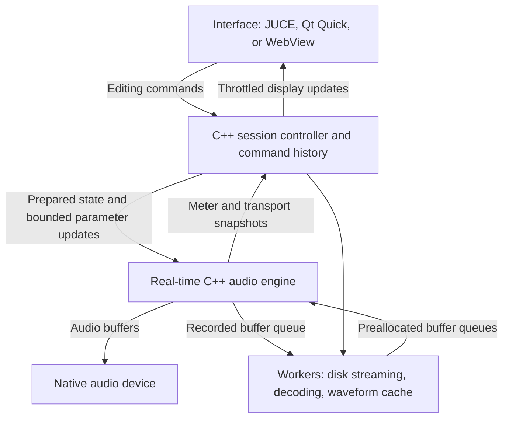

# Theta: production architecture proposal

Status: research-backed direction, 2026-09-08. A small [native engine evaluation](native/README.md) has started; production frontend selection and macOS validation remain pending. See [the DAW source study](research/DAW-STUDY.md), [device contract](research/DEVICE-SYSTEM.md), [interaction specification](research/UX-SPEC.md), and [staged plan](research/ROADMAP.md).

## Product intent

Build a desktop DAW for complete songs, with electronic composition first and audio recording alongside it. Large projects and predictable playback matter.

Confirmed: prioritize Windows development now while keeping macOS in the architecture; personal use; internal modular instruments/effects are required, while external plugin hosting is not an initial requirement. Both arrangement and live clip workflows matter, starting with electronic music. Target hardware, project sizes, and the initial sound palette remain to be established.

UI performance, consistent frame pacing/FPS, and immediate pointer response are confirmed priorities alongside visual quality. These are frontend acceptance criteria under real audio and editing load, not optional polish.

## What Exists

The current source is a native C++20/Tracktion/JUCE application with a pattern editor, two-track arrangement view, audio import, native project save/open, and focused native tests.

## Proposed engine direction

Use C++20 for the production audio engine and evaluate JUCE for audio-device, MIDI, plugin-host, and desktop integration. C++ gives control over memory, lifetime, threading, and native interoperability, but real-time behavior still depends on the implementation.

Before building a custom DAW engine, evaluate Tracktion Engine. It is a JUCE-based C++ engine with a sequenced project model, audio/MIDI playback, automation, recording, plugin support, and rendering. Its built-in device registration is directly relevant to the intended modularity. Record its independent licensing when pinning dependencies for personal development; commercial distribution is not an assumed requirement. JUCE by itself is a toolkit, not a complete DAW engine.

The engine evaluation should implement one representative path: open a project, play streamed audio and MIDI, apply an internal device, edit while playing, record, save, reopen, and render. Run the same fixture on Windows and macOS. If Tracktion cannot meet measured requirements, evaluate a smaller custom engine on JUCE with an explicit feature budget.

## Separate the interface from audio execution

The audio device clock owns transport. The audio thread must never wait for the interface, disk access, plugin scanning, JSON parsing, ordinary locks, or memory allocation. Prepare data off the audio thread, communicate through bounded queues or suitable atomics, and reclaim retired state off that thread. Queue saturation and underruns need explicit behavior and telemetry.

Audio buffers do not travel through a JavaScript UI bridge. The UI sends commands such as `moveClip` or `setParameter`; it receives acknowledged model changes and bounded-rate meters. This does not imply that arbitrary JavaScript gestures have zero latency: the native controller converts accepted changes into engine events with explicit scheduling rules.

Built-in device processing is native and uses a registry with stable device/parameter identities, preparation and processing lifecycles, versioned state, and editor-independent DSP. Start with modules compiled into the application; modularity does not require a dynamic binary plugin ABI. If third-party hosting is added later, scanning should run in a separate process with timeout and crash handling. Isolating third-party processing itself is a separate decision with performance and synchronization costs.

## Interface decision

| Candidate | Advantages for Theta | Costs and questions |
| --- | --- | --- |
| Native JUCE UI | Direct native/plugin-window integration; control over painting, allocations, and event handling; one primary language | Reimplement current controls and interactions; custom timeline rendering and accessibility still require work |
| Qt Quick/QML with C++ rendering | Declarative native layout and custom scene-graph rendering; demonstrated by current Zrythm source | Qt/JUCE event-loop integration, deployment, thread ownership, and dense editor behavior need testing |
| JUCE shell with HTML/CSS/TypeScript WebView | Rapid visual iteration; C++ engine remains independent | Browser memory, native bridge design, OS WebView differences, focus/drag behavior, and rendering under load need measurement |

JavaScript is not automatically the best interface technology. Nor does a native interface automatically scale. Both need visible-region rendering, waveform caches, bounded meter updates, incremental model changes, and disciplined allocations.

Proposed decision method: evaluate JUCE native first for integration with the leading engine candidate, then Qt Quick as the principal alternative for a customized visual workspace. Compare the same small timeline/device slice, driven by the same engine, on both platforms. Keep WebView as an option; select from measurements of interaction, rendering, memory, and integration costs.

Apply the [frame-pacing and pointer-response gates](research/UX-SPEC.md#frame-pacing-and-pointer-response) to every candidate. Target refresh-aware 60/120 Hz interaction on reference hardware, measure event-to-presented-control latency and frame-time tails, and verify that UI activity does not introduce audio underruns. A drag preview must not wait for an audio-thread acknowledgement or media processing. Presentation performance and authoritative edit correctness must both pass; average FPS or idle screenshots cannot settle the frontend choice.

Adding Rust/Tauri would introduce another language boundary without presently established benefits for this C++ audio-stack direction. Keep it out of the initial shortlist unless a concrete requirement changes that assessment.

## Large-project design requirements

- Stream audio from project files through bounded read-ahead caches. Decode and generate multiresolution waveform peaks in background workers.
- Persist a versioned session document, media files, and caches separately. Provide a portable collect-and-save operation, atomic document saves, crash recovery, and missing-media relinking.
- Use editing commands and incremental undo; avoid cloning complete projects and embedded media on each edit.
- Separate musical time from sample time. Support a tempo map and defined conversions.
- Compile an indexed playback representation. Avoid scanning every note in the project per callback or UI frame.
- Define audio routing, plugin latency compensation, automation timing, voice limits, tails, and block-boundary behavior before adding complex features.
- Support offline rendering using the same processing model as playback. Test equivalence where plugins are deterministic.
- Treat clip launching, recording, monitoring, and transport synchronization as engine features. The current arrangement-only UI is not a complete definition of “like Ableton.”

## Proposed evidence before committing

Select reference hardware, driver, sample rate, and project fixtures together. Track count alone does not describe load; include audio formats, plugin chains, voices, routing, and storage.

Suggested starting fixtures, subject to agreement:

1. Audio deadline: measure callback maxima and distribution, plus underruns, at 48 kHz / 128 samples. That buffer gives approximately 2.67 ms per block; it is not a round-trip latency claim.
2. Session scale: benchmark 32, 64, and 128 streamed stereo tracks, then defined synth and effect workloads. Report the limit on the reference machine rather than promising universal capacity.
3. Editing scale: 10,000 clips / 100,000 notes as a UI fixture; measure interaction latency, frame time, startup, memory, and scrolling while audio plays.
4. Recording: long-duration capture, timestamp alignment, stop/start boundaries, disk pressure, and measured input/output latency compensation.
5. Resilience: loading and saving during playback, device changes, missing files, rejected plugins, scan crashes, and recovery after forced termination.
6. Correctness: note timing across tempo changes, automation, plugin delay compensation, state restoration, and rendered output.

These are evaluation proposals, not passed benchmarks or supported product limits.

## Development sequence

1. Record the confirmed platform/personal-use/internal-device scope and agree on measurable targets.
2. Establish and maintain a native build plus engine evaluation harness.
3. Prove native audio output, MIDI sequencing, streamed playback, recording, and rendering independently of the UI.
4. Compare frontend candidates against the same engine and fixtures; record the decision.
5. Build out one complete workflow on the selected native stack.
6. Add routing, automation, racks, clip launching, and editing depth in measured increments. Add external plugin hosting only if wanted.

## Primary references

- [PortAudio: real-time callback constraints](https://portaudio.com/docs/v19-doxydocs/writing_a_callback.html)
- [JUCE: native C++ framework](https://juce.com/)
- [JUCE: WebView UI integration and platform differences](https://juce.com/blog/juce-8-feature-overview-webview-uis/)
- [Tracktion Engine: purpose, platforms, C++ requirements, and separate licensing](https://github.com/Tracktion/tracktion_engine)
- [Tracktion Engine: playback, plugins, recording, automation, and clip launching](https://github.com/Tracktion/tracktion_engine/blob/develop/FEATURES.md)
- [VST3: processing, editing, and threading interfaces](https://steinbergmedia.github.io/vst3_dev_portal/pages/Technical%2BDocumentation/API%2BDocumentation/Index.html)
