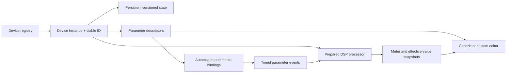

# Theda device system

Status: proposed application contract. This is a design specification, not an implemented SDK or an ABI promise.

## What “plugin architecture” means here

Every sound generator, effect, MIDI utility, and modulator is a device. The engine discovers devices through a registry, instantiates them, connects their ports, manages their state, and schedules their work. Built-ins can be compiled into the application while retaining separate modules and tests. Dynamic libraries and third-party VST3/AU/CLAP hosting are later adapters if wanted.

A new synth should require a device module, presets, and an optional editor—not changes throughout the transport, save system, mixer, and piano roll. This follows the separations observed in [Tracktion, Ardour, and LMMS](DAW-STUDY.md#open-source-comparison).

## Boundaries



The editor can disappear without destroying the sound. DSP code has no dependency on QML, HTML, windows, mouse input, or graphics APIs. UI descriptors and assets belong to the presentation layer.

If Tracktion is selected, its Plugin, AutomatableParameter, and state mechanisms should implement these responsibilities. Avoid wrapping them in a duplicate full engine. Keep a small facade for application commands and device metadata where it provides clear value.

## Required device information

| Area | Required behavior |
| --- | --- |
| Identity | Stable type ID such as `org.theda.analog-bass`; separate stable instance ID; schema version; human-readable name and tags |
| Ports | Explicit audio input/output buses, channel capabilities, note/event ports, and optional sidechain inputs |
| Parameters | Stable IDs, range and units, default, linear/logarithmic mapping, quantization, automation capability, modulation capability, and smoothing policy |
| Lifecycle | Create and load assets off the audio thread; prepare for sample rate and maximum block; process bounded blocks; reset/flush; release off the audio thread |
| Timing | Audio-block sample range, event offsets within the block, musical position/tempo context, and transport discontinuity flags |
| Latency | Report algorithmic latency and changes; define latency-preserving bypass and monitoring behavior |
| Tails | Report silence/tail behavior; account for self-oscillation and generators that produce output without input |
| State | Versioned preset and instance state; explicit migration; media references rather than embedded multi-gigabyte data |
| Faults | Bounded overflow behavior, non-finite output handling, and diagnostic counters; never log or throw through the callback |
| Presentation | Generic editor available from descriptors; custom editor optional; consistent gestures, automation marks, undo, and accessibility |

## Parameters are a shared system

Distinguish the stored/base value, automation value, modulation offset, and final DSP value. A number drawn beside a knob must make clear whether it shows the base or effective value.

Proposed default behavior: playback automation drives the automated value; an explicit user gesture temporarily overrides that lane until “Resume automation”; modulation applies to the current base/automated value according to a documented range; smoothing occurs in the DSP path. Discrete choices use defined quantization and do not interpolate through invalid values. This policy is our proposed behavior, not a universal rule imposed by a framework.

Gesture boundaries must be explicit: begin, update, end. A knob drag creates one undo action. Host notifications or meter refreshes never create new undo entries. Scheduled changes carry sample offsets; the GUI refresh rate never determines automation precision.

## Composable racks

Begin with serial chains:

```text
Note input → MIDI utilities → Instrument → Audio effects → Track output
Audio input or clip playback → Audio effects → Track output
```

Next support parallel chains through an explicit split/mix container, then named macro mappings to parameter ranges. A drum rack maps incoming notes to chains and can define choke groups. Presets reference device IDs and versions and store the entire rack structure.

Keep the initial routing graph acyclic. If feedback is introduced, require an explicit delay element and define stability, latency, and reset behavior. Keep audio-rate modulation, control-rate modulation, and event routing distinguishable; “everything connects to everything” is not a sufficient contract.

## First modules

1. Utility gain/pan: proves parameter smoothing, bypass, serialization, automation, and rendering correctness.
2. Sampler: proves media lifecycle, note offsets, voice limits, release tails, and streaming/caching policy.
3. Polyphonic subtractive synth: proves voice allocation and note expression without special transport code.
4. Filter/EQ and delay: prove reusable effects, tails, tempo synchronization, and parameter automation.
5. Drum rack and macro container: prove composition of devices.

Keep the prototype's sound names and demo composition as migration fixtures. Do not claim the browser synths and native replacements will sound identical without matching oscillator, envelope, filter, pan, and effect behavior.

## Extension policy

For personal development, statically registered modules are the simplest reliable first step. A C++ class hierarchy compiled together is not a stable binary interface across compilers or versions. If independently compiled device packs become necessary, select a versioned C ABI or an existing plugin standard deliberately. Third-party plugin discovery, native editor hosting, crash isolation, and compatibility testing are separate responsibilities.

## Acceptance tests

- A new device appears in the browser and can be added without changing transport or file-format code.
- Headless tests can instantiate and render it with no editor loaded.
- Saved parameter and rack state restores on both Windows and macOS.
- Preparation may allocate; steady-state processing within configured limits does not allocate or wait on non-audio work.
- Automation and note events land at their intended offsets, including across blocks and tempo changes.
- Latency, bypass, tails, all-notes-off, seek, and loop resets behave predictably.
- Missing device types preserve opaque state and connections so reinstalling the module can restore them.
